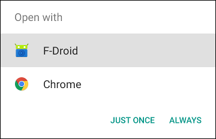
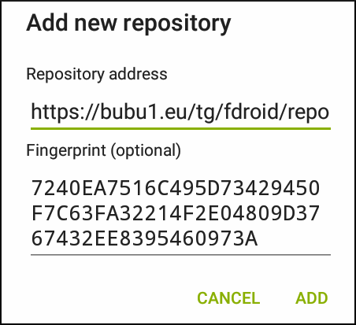

### Installing Telegram via F-Droid

**Donate:**  1o4KG7Qw31tiabGLqD1NUHqBUPW28q6Gc

1. Install the <a href="https://f-droid.org/">F-Droid app</a>

2. Open <a href="https://raw.githubusercontent.com/TelegramMirror/mirror/master/fdroid/repo?fingerprint=7240EA7516C495D73429450F7C63FA32214F2E04809D3767432EE8395460973A">this link</a> on your mobile device. (If you're using Firefox, long-click the link and choose **Open with F-Droid App**.)

<b>OR</b> scan this QR code: 

3. Choose <b>F-Droid</b>, then click <b>Just Once</b>.  

4. When the <b>Add new repository</b> screen appears, click <b>Add</b>.

5. F-Droid will update the list of available apps. When it finishes, search for <b>Telegram</b> in the F-Droid app.
